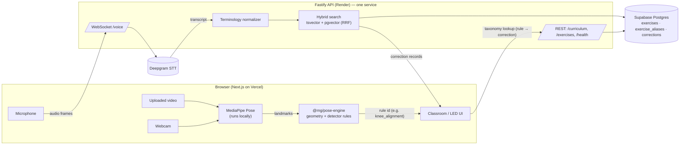
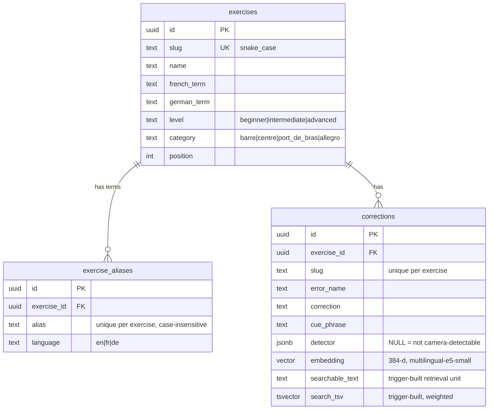

# Architecture — musical-goggles AI Classroom

> Status: **Phase 5 implemented**. Token-protected curriculum CRUD and shared UI navigation/states are available. Voice/typed retrieval, uploaded-video and live-camera inputs share the taxonomy. Real microphone STT verification needs a key; real webcam capture is blocked by permission in the verification browser; ballet movement validation remains outstanding.

## The one rule

There is **one** correction taxonomy. Voice retrieval, uploaded-video analysis and live-camera analysis all resolve to the **same `corrections` rows**. No input mode carries its own copy of correction text.



Video and camera frames never leave the browser. Only curriculum/search requests and voice audio for STT cross the app network; pose events also stay in the browser.

## Repository layout

| Path                   | Responsibility                                                                                                                      |
| ---------------------- | ----------------------------------------------------------------------------------------------------------------------------------- |
| `apps/web`             | Next.js 16 App Router + Tailwind v4. Classroom UI, curriculum, voice, uploaded video and webcam + MediaPipe.                        |
| `apps/api`             | Fastify 5. REST, (Phase 2) voice WebSocket + Deepgram, retrieval, admin CRUD, structured logs.                                      |
| `packages/taxonomy`    | Domain vocabulary: detector contract (`DETECTOR_RULES`, `DetectorSchema`), levels, categories, slugs.                               |
| `packages/shared`      | API wire contract as zod schemas + inferred types, used by both API (responses) and web (validation).                               |
| `packages/pose-engine` | Framework-free pose geometry and the rule-evaluation contract. Phase 3 adds rules + debounce, used identically by video and camera. |
| `supabase/`            | SQL migrations (Supabase-CLI compatible names) and `seed.sql` (DEMO DATA).                                                          |

Workspace packages ship TypeScript source (no per-package build). Next.js compiles them via `transpilePackages`; the API bundles them with tsup, keeping npm dependencies external.

## Data model



### Detector

```json
{ "type": "geometric", "rule": "knee_alignment", "threshold": 0.05, "min_duration_ms": 300 }
```

- `NULL` means the correction is **not** camera-detectable. That is the default and the honest answer for most of ballet.
- The DB `CHECK` enforces the minimum shape; `@mg/taxonomy` enforces the strict shape (known rule, threshold in (0,1], no extra keys — so correction text can never hide inside a detector).
- An invalid stored detector is served as "not supported" **and** flagged (`detectorIssue`) in the API and UI; it never silently enables detection.
- The pose engine outputs only a rule id + measurement. Text (error name, cue, correction) always comes from the taxonomy row.

Seeded candidates (real-movement validation remains outstanding; unreliable checks should revert to `NULL`):

| Exercise     | Error                   | Rule                 |
| ------------ | ----------------------- | -------------------- |
| Demi-plié    | Knees collapsing inward | `knee_alignment`     |
| Demi-plié    | Heels lifting           | `heel_lift`          |
| Port de bras | Shoulders rising        | `shoulder_elevation` |

### Retrieval unit and search document

A `BEFORE INSERT/UPDATE` trigger on `corrections` builds:

- `searchable_text` = `exercise | terminology (fr, de, aliases) | error | correction | cue` — the exact text Phase 2 embeds.
- `search_tsv` with weights: **A** exercise terminology (`simple`), **B** error + cue (`simple`), **C** error/correction/cue/description (`english`, stemmed). All input is `unaccent`ed so _plie_ matches _plié_. `simple` is used for terms because stemming French/German with the English dictionary would corrupt them.

Changing an exercise's terms or aliases re-runs the trigger for its corrections, so **a new or edited correction is searchable immediately without code changes**. If the retrieval text changes, the stored embedding is set to `NULL` (stale vectors never rank); Phase 2 backfills missing embeddings.

Indexes: GIN on `search_tsv`, HNSW (`vector_cosine_ops`) on `embedding`, FK btree indexes, partial index on detectable corrections.

### Hybrid ranking (Phase 2)

1. Normalize transcript deterministically (lowercase, unaccent, alias table → canonical exercise, body-part synonyms incl. German, e.g. _Schultern → shoulders_).
2. Full-text candidates: `websearch_to_tsquery` over both `simple` and `english` configs, ranked by `ts_rank_cd`.
3. Semantic candidates: e5 query embedding, cosine distance via HNSW.
4. Restrict both candidate lists to a confidently detected exercise; retry globally if the restricted merge is empty. Fuse with **Reciprocal Rank Fusion** (`score = Σ 1/(60 + rank)`), return up to five records from 30 candidates per source. Natural-language filler is removed and remaining terms are OR-ed for FTS recall; English stemming still runs in PostgreSQL.
5. No LLM on the critical path. An optional LLM fallback may be added later only for low-confidence queries.

## API (Phase 1)

| Route                  | Purpose                                                                                       |
| ---------------------- | --------------------------------------------------------------------------------------------- |
| `GET /health`          | Liveness. Always `{"status":"ok"}`; never touches the DB (Render health check).               |
| `GET /health/ready`    | Readiness incl. DB ping; `503 {"status":"degraded"}` when the DB is down.                     |
| `GET /curriculum`      | Full taxonomy, nested, with `coverage` (camera-detectable / total) and `dataset` = DEMO DATA. |
| `GET /exercises/:slug` | One exercise with its corrections.                                                            |

Errors are always `{ "error": { "code", "message", "requestId" } }` with codes `BAD_REQUEST`, `NOT_FOUND`, `DATABASE_UNAVAILABLE` (503), `DATA_INTEGRITY`, `INTERNAL`. Embedding vectors are never returned.

## Observability

One structured JSON line per request: `request_id` (from a safe `x-request-id` header or a fresh UUID, echoed back), `route`, `method`, `status_code`, `duration_ms`. Errors add `error_code` and the stack for 5xx. Auth/cookie headers are redacted; request bodies are never logged. Phase 2 adds `deepgram_duration_ms` and `search_duration_ms`.

## Security & privacy

- **Pose analysis is client-side.** MediaPipe runs in the browser; raw video/webcam frames are not uploaded to our backend. This is an architectural decision, not a setting.
- Phase 2 audio is streamed to Deepgram for transcription only and is not stored or logged by our API.
- The browser never talks to the database. `DATABASE_URL` and `DEEPGRAM_API_KEY` exist only in the API's environment. RLS is enabled with no policies on all tables, closing Supabase's anon PostgREST path.
- No child data is required or collected for this demo.

## Decisions (and why)

| Decision                                                     | Why                                                                                                                                                       |
| ------------------------------------------------------------ | --------------------------------------------------------------------------------------------------------------------------------------------------------- |
| `pg` (node-postgres) over `supabase-js`                      | Hybrid search needs raw SQL (tsvector, pgvector operators, CTEs). One connection string, provider-agnostic.                                               |
| Extensions in `extensions` schema; SQL schema-qualifies them | Supabase convention; avoids depending on `search_path`, which transaction poolers don't preserve.                                                         |
| `vector(384)` / multilingual-e5-small                        | Local model, no extra API key, multilingual (FR/DE). Measured ~620 MiB RSS locally in Phase 2; disabled by default pending target-host memory validation. |
| Search doc built by trigger, not app code                    | Single place builds the retrieval unit; admin edits and SQL edits behave the same.                                                                        |
| `/health` DB-independent + `/health/ready`                   | Render restarts on failed health checks; a DB blip must not kill the API.                                                                                 |
| Curriculum fetched client-side                               | Render free tier cold starts (~30–60 s) would exceed Vercel function limits if fetched during SSR; the browser can show a "waking up" state.              |
| Forward-only SQL migration runner                            | No ORM; same files work with `supabase db push`.                                                                                                          |

## Phase 2 protocol and runtime

`packages/shared/src/voice.ts` defines zod contracts. `POST /search` accepts `{ "query": "knees in during plie" }` (1–1000 characters), and returns the original/normalized query, detected exercise, real correction DTOs, mode and timings. Ranking details appear only with server-side `SEARCH_DEBUG=true`.

WebSocket `/voice` has one recording per connection:

- Client JSON: `start` with supported `mimeType`, `stop`, `ping`. Strict schemas reject unknown keys. Audio uses binary frames (maximum 256 KiB/frame), never base64 JSON. Ping receives a WebSocket protocol pong.
- Server JSON: `ready`, `transcript` with `text` and `final`, `searching`, `results` with the same search response, `metrics`, `error` with a code and safe message.
- Wait for `ready` before audio. Browser prefers WebM/Opus, then supported Ogg/Opus or MP4; MediaRecorder emits around 250 ms chunks. Containerized audio is auto-detected by Deepgram; no raw PCM encoding override is sent.
- Stop drains the final recorder blob before `stop`. API sends Deepgram `CloseStream`, drains finalized speech and pending searches, then closes. Client unmount/retry/error stops all microphone tracks and closes the socket.
- The direct Deepgram WebSocket API uses Nova-3, `language=multi`, interim results, 500 ms endpointing, utterance-end events, and ballet keyterms. API key stays in the Authorization header on the server-to-Deepgram connection.
- Interim text is displayed only. Final segments accumulate until speech-final/utterance-end, a 1.5 s final-segment fallback, or stop. Segment timestamps and normalized utterance text suppress retransmissions/repeated finals within a recording.
- Limits: 10 s Deepgram handshake, 30 s without a recognized utterance, 120 s recording session, 20 utterances/session, bounded WebSocket buffers. Origin checked against CORS allowlist. Missing keys, malformed messages, wrong state, disconnects, silence and failed searches produce explicit errors.
- Timings: normalization includes reading taxonomy terms; search includes embedding and SQL/ranking. STT is final-utterance delivery delay since the latest audio chunk, **not** provider-internal recognition latency. Total adds this delivery delay to retrieval, excluding speaking duration. Typed requests use null STT timing. Logs contain numeric timings only, never transcript/audio payloads.

Normalizer folds accents, punctuation, hyphens and case, then finds the longest whole-phrase match in current exercise names, French/German terms and `exercise_aliases`. Tied matches for different exercises do not filter. Canonical French terms replace matched terms; deterministic body/error vocabulary translates Schultern/Knie/Fersen and “knees in”/“heels coming up”. No extra taxonomy or LLM is introduced.

`EmbeddingProvider` isolates model implementation. E5 loads lazily via Transformers.js, uses q8 weights, mean pooling, L2 normalization and `query: `/`passage: ` prefixes for all languages. Inference is serialized per provider. API never downloads weights and defaults to FTS. A failed local-model load is cached for that process; restart after populating its model cache. Semantic SQL only uses rows whose `embedding_model` matches the provider. Backfill writes only NULL rows whose `searchable_text` still equals the text embedded; the existing Phase 1 invalidation triggers remain authoritative.

No schema changes were required. See [verification and memory observations](phase2-verification.md).

## Phase 3 browser processing

The `/video` client loads the existing `GET /curriculum`, filters corrections through the pose engine's supported-rule registry, and lets the user select exercise context. It passes only correction IDs and detector configurations to the engine. Correction names, cues and instructions always come from the same DTOs served to voice retrieval. No CV database or new API route is needed.

`video-analysis.ts` seeks a local blob-backed player at 100 ms media-time intervals, waits for decoded frames, resizes input to at most 960 pixels on its longest edge, and transfers one `ImageBitmap` at a time to `pose.worker.ts`. MediaPipe Tasks Vision 1.0.1 runs `PoseLandmarker.detectForVideo` in VIDEO mode with the version-1 Lite float16 model and CPU delegate. Inference stays off the main thread. The worker also owns the input-independent `PosePipeline`; the Phase 4 webcam source uses this same worker without changing detectors or event filtering.

MediaPipe image x/y coordinates are corrected for aspect ratio before torso normalization. Pure rule functions return side, rule, status, normalized measurement, minimum visibility and relevant landmark indices. Visibility is a tracking-quality measure, not a correction confidence score. Empty or multi-person frames produce unmeasurable results. A fixed frontal view is required.

`PosePipeline` owns shoulder-baseline calibration and one temporal filter per correction/side. Candidate violations need the configured `min_duration_ms` and at least three sampled frames. Active events need 400 ms and three clear frames to clear. Missing/uncertain tracking or a >350 ms sample gap ends the observed interval as tracking-lost; it is never labeled recovery. Event starts retain the initial candidate timestamp; confirmed and end timestamps are separately represented. Cancellation/EOF close intervals at the last analyzed frame. Reset creates a new pipeline.

The UI keeps sampled landmarks for replay overlays and event intervals for seeking/highlighting; it does not retain a growing event-history copy per frame. Model workers are terminated on completion, cancellation, error, file replacement and unmount. Blob URLs are revoked on replacement/unmount. Measurements and derived timelines remain in browser memory only.

The current runtime includes usage telemetry. A CSP on the worker script response permits only same-origin assets and pinned model/WASM asset paths; other worker connections are blocked. This is scoped to script responses so the voice page's API/WebSocket connections are unaffected. The browser downloads runtime/model assets but no code path uploads media. Hosting must preserve these headers.

See [Phase 3 verification](phase3-verification.md) for precise geometry, limitations and measured results.

## Phase 4 live input source

`LiveCameraSession` acquires a video-only `getUserMedia` stream and attaches it to a muted inline player. It uses the shared `captureFrame` resize/bitmap helper and unchanged `PoseWorkerClient`/`pose.worker.ts` protocol. No second MediaPipe model implementation, detector rule or temporal filter exists.

Camera states: `idle → requesting → loading_model → calibrating (shoulders only) → analyzing`; Stop or tab hiding ends in `stopped`, failures in `error`. Restart creates a fresh session. Permission and playback waits are bounded; a late permission grant after cancellation immediately stops its tracks. Stream ended/mute, unmount and pagehide release all resources. Device switching requires stop, choosing the browser/system default camera, then start.

A recursive timer targets 100 ms wall-clock intervals and skips missed slots instead of queueing frames. Duplicate media timestamps are skipped. Stale UI measurements clear after 350 ms; five seconds without new camera frames is an error. The worker has existing initialization and frame timeouts. Shoulder calibration remains entirely in `PosePipeline`; the wrapper imposes a 30-second deadline. A ten-minute session bound limits the existing temporal event history. React retains only the latest frame and scalar aggregate metrics, with no recording or landmark history.

Only temporal events with an open interval generate current correction cards. IDs are deduplicated across left/right and resolved against the selected exercise's live curriculum DTOs. Raw per-frame violations never generate cards. Unsupported checks remain unavailable; absent/low-confidence poses do not claim correct technique.

The unchanged worker response CSP blocks MediaPipe telemetry destinations and permits pinned model assets. No backend routes, database schema, voice/retrieval logic or dependencies were added for Phase 4. See [Phase 4 verification](phase4-verification.md).

## Phase 5 curriculum management

The browser admin screen uses the existing Fastify API and PostgreSQL taxonomy. `@mg/shared` exports strict exercise/correction input schemas, reusing `DetectorSchema`. Editable fields are explicitly enumerated; embedding, searchable text, tsvector, IDs and timestamps cannot be submitted. There is no new database schema or RLS change.

| Method | Route                              | Behavior                                                             |
| ------ | ---------------------------------- | -------------------------------------------------------------------- |
| GET    | `/admin/status`                    | Verify the admin token; no-store response                            |
| POST   | `/admin/exercises`                 | Create an exercise and aliases atomically; 201 + ID                  |
| PUT    | `/admin/exercises/:id`             | Replace editable exercise fields and sync aliases; 200 + ID          |
| POST   | `/admin/exercises/:id/corrections` | Create a correction in that exercise; 201 + ID                       |
| PUT    | `/admin/corrections/:id`           | Replace editable correction fields, preserving ID/exercise; 200 + ID |
| DELETE | `/admin/corrections/:id`           | Delete the correction; 200 + ID, subsequent deletion 404             |

Every admin route requires `Authorization: Bearer <ADMIN_API_TOKEN>`. The server compares token digests in constant time. Missing configuration disables the routes with 503 `ADMIN_DISABLED`; missing/wrong authorization returns 401 `UNAUTHORIZED`. The token is never a public env value or stored in browser persistence, and existing logging redacts Authorization. Admin supports one trusted operator; per-user accounts, audit history and concurrent edit conflict resolution are not implemented.

Writes use parameterized raw SQL and a checked-out client transaction. Alias synchronization is incremental so saving unchanged aliases does not transiently delete terms and invalidate vectors. Existing triggers maintain search documents and embeddings. Constraint conflicts return 409, malformed/invalid inputs 400, absent records/parents 404. Responses never expose vectors. Ambiguous network failures tell the user to reload before retrying; writes are not retried automatically.

UI primitives now share navigation, status colors, failure/loading/empty messages and technical-panel presentation. Camera badges distinguish implemented prototypes from metadata-only checks, without changing the API's metadata coverage semantics. Voice transport, ranking, embedding providers and pose-engine behavior remain unchanged. See [Phase 5 verification](phase5-verification.md).
