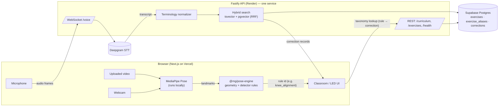
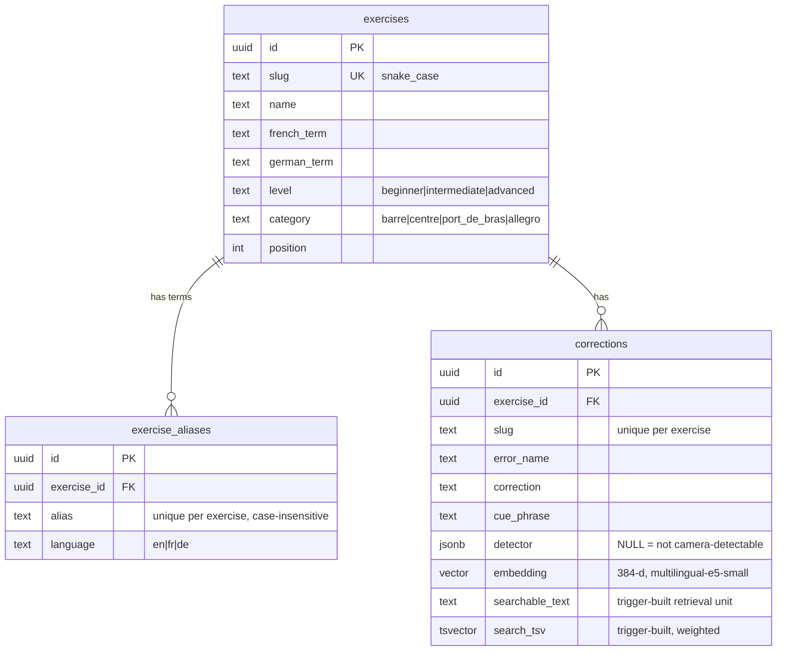

# Architecture — musical-goggles AI Classroom

> Status: **Phase 1 (foundation)**. Voice (Phase 2), uploaded video (Phase 3) and live camera (Phase 4) are designed here but not yet built.

## The one rule

There is **one** correction taxonomy. Voice retrieval, uploaded-video analysis and live-camera analysis all resolve to the **same `corrections` rows**. No input mode carries its own copy of correction text.



Video and camera frames never leave the browser. Only rule ids and, in Phase 2, audio for STT cross the network.

## Repository layout

| Path                   | Responsibility                                                                                                                      |
| ---------------------- | ----------------------------------------------------------------------------------------------------------------------------------- |
| `apps/web`             | Next.js 16 App Router + Tailwind v4. Classroom UI, curriculum view; later mic / video / webcam + MediaPipe.                         |
| `apps/api`             | Fastify 5. REST, (Phase 2) voice WebSocket + Deepgram, retrieval, admin CRUD, structured logs.                                      |
| `packages/taxonomy`    | Domain vocabulary: detector contract (`DETECTOR_RULES`, `DetectorSchema`), levels, categories, slugs.                               |
| `packages/shared`      | API wire contract as zod schemas + inferred types, used by both API (responses) and web (validation).                               |
| `packages/pose-engine` | Framework-free pose geometry and the rule-evaluation contract. Phase 3 adds rules + debounce, used identically by video and camera. |
| `supabase/`            | SQL migrations (Supabase-CLI compatible names) and `seed.sql` (DEMO DATA).                                                          |

Workspace packages ship TypeScript source (no per-package build). Next.js compiles them via `transpilePackages`; the API bundles them with tsup, keeping npm dependencies external.

## Data model



### Detector

```json
{ "type": "geometric", "rule": "knee_alignment", "threshold": 0.05, "min_duration_ms": 300 }
```

- `NULL` means the correction is **not** camera-detectable. That is the default and the honest answer for most of ballet.
- The DB `CHECK` enforces the minimum shape; `@mg/taxonomy` enforces the strict shape (known rule, threshold in (0,1], no extra keys — so correction text can never hide inside a detector).
- An invalid stored detector is served as "not supported" **and** flagged (`detectorIssue`) in the API and UI; it never silently enables detection.
- The pose engine outputs only a rule id + measurement. Text (error name, cue, correction) always comes from the taxonomy row.

Seeded candidates (Phase 3 must validate on real footage, and revert any unreliable one to `NULL`):

| Exercise     | Error                   | Rule                 |
| ------------ | ----------------------- | -------------------- |
| Demi-plié    | Knees collapsing inward | `knee_alignment`     |
| Demi-plié    | Heels lifting           | `heel_lift`          |
| Port de bras | Shoulders rising        | `shoulder_elevation` |

### Retrieval unit and search document

A `BEFORE INSERT/UPDATE` trigger on `corrections` builds:

- `searchable_text` = `exercise | terminology (fr, de, aliases) | error | correction | cue` — the exact text Phase 2 embeds.
- `search_tsv` with weights: **A** exercise terminology (`simple`), **B** error + cue (`simple`), **C** error/correction/cue/description (`english`, stemmed). All input is `unaccent`ed so _plie_ matches _plié_. `simple` is used for terms because stemming French/German with the English dictionary would corrupt them.

Changing an exercise's terms or aliases re-runs the trigger for its corrections, so **a new or edited correction is searchable immediately without code changes**. If the retrieval text changes, the stored embedding is set to `NULL` (stale vectors never rank); Phase 2 backfills missing embeddings.

Indexes: GIN on `search_tsv`, HNSW (`vector_cosine_ops`) on `embedding`, FK btree indexes, partial index on detectable corrections.

### Hybrid ranking (Phase 2 plan)

1. Normalize transcript deterministically (lowercase, unaccent, alias table → canonical exercise, body-part synonyms incl. German, e.g. _Schultern → shoulders_).
2. Full-text candidates: `websearch_to_tsquery` over both `simple` and `english` configs, ranked by `ts_rank_cd`.
3. Semantic candidates: e5 query embedding, cosine distance via HNSW.
4. Fuse with **Reciprocal Rank Fusion** (`score = Σ 1/(60 + rank)`), boost rows matching a detected exercise, return top N.
5. No LLM on the critical path. An optional LLM fallback may be added later only for low-confidence queries.

## API (Phase 1)

| Route                  | Purpose                                                                                       |
| ---------------------- | --------------------------------------------------------------------------------------------- |
| `GET /health`          | Liveness. Always `{"status":"ok"}`; never touches the DB (Render health check).               |
| `GET /health/ready`    | Readiness incl. DB ping; `503 {"status":"degraded"}` when the DB is down.                     |
| `GET /curriculum`      | Full taxonomy, nested, with `coverage` (camera-detectable / total) and `dataset` = DEMO DATA. |
| `GET /exercises/:slug` | One exercise with its corrections.                                                            |

Errors are always `{ "error": { "code", "message", "requestId" } }` with codes `BAD_REQUEST`, `NOT_FOUND`, `DATABASE_UNAVAILABLE` (503), `DATA_INTEGRITY`, `INTERNAL`. Embedding vectors are never returned.

## Observability

One structured JSON line per request: `request_id` (from a safe `x-request-id` header or a fresh UUID, echoed back), `route`, `method`, `status_code`, `duration_ms`. Errors add `error_code` and the stack for 5xx. Auth/cookie headers are redacted; request bodies are never logged. Phase 2 adds `deepgram_duration_ms` and `search_duration_ms`.

## Security & privacy

- **Pose analysis is client-side.** MediaPipe runs in the browser; raw video/webcam frames are not uploaded to our backend. This is an architectural decision, not a setting.
- Phase 2 audio is streamed to Deepgram for transcription only and is not stored or logged by our API.
- The browser never talks to the database. `DATABASE_URL` and `DEEPGRAM_API_KEY` exist only in the API's environment. RLS is enabled with no policies on all tables, closing Supabase's anon PostgREST path.
- No child data is required or collected for this demo.

## Decisions (and why)

| Decision                                                     | Why                                                                                                                                          |
| ------------------------------------------------------------ | -------------------------------------------------------------------------------------------------------------------------------------------- |
| `pg` (node-postgres) over `supabase-js`                      | Hybrid search needs raw SQL (tsvector, pgvector operators, CTEs). One connection string, provider-agnostic.                                  |
| Extensions in `extensions` schema; SQL schema-qualifies them | Supabase convention; avoids depending on `search_path`, which transaction poolers don't preserve.                                            |
| `vector(384)` / multilingual-e5-small                        | Local model, no extra API key, multilingual (FR/DE). Trade-off: RAM and cold start on Render free tier — to be measured in Phase 2.          |
| Search doc built by trigger, not app code                    | Single place builds the retrieval unit; admin edits and SQL edits behave the same.                                                           |
| `/health` DB-independent + `/health/ready`                   | Render restarts on failed health checks; a DB blip must not kill the API.                                                                    |
| Curriculum fetched client-side                               | Render free tier cold starts (~30–60 s) would exceed Vercel function limits if fetched during SSR; the browser can show a "waking up" state. |
| Forward-only SQL migration runner                            | No ORM; same files work with `supabase db push`.                                                                                             |
